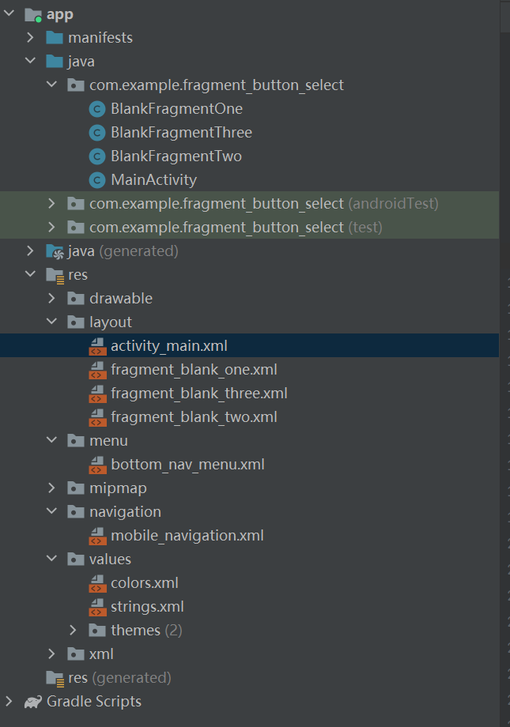
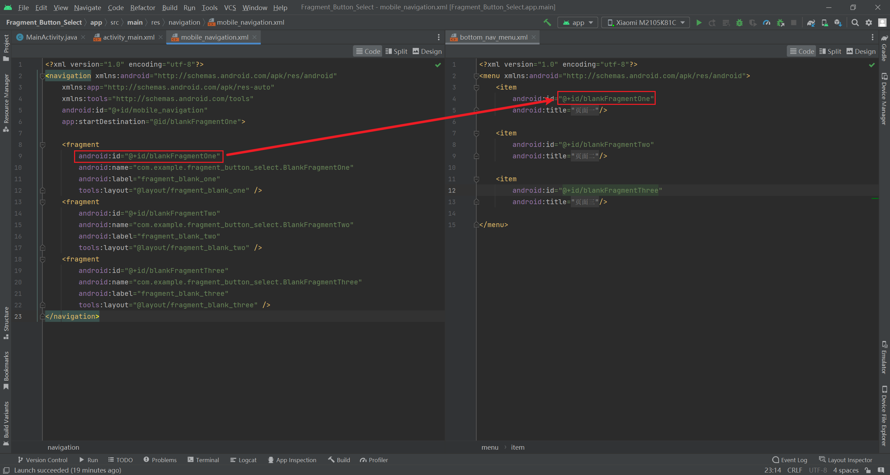

### Fragment_Button_Select

> 主要实现功能：页面切换

实现底部通过**BottomNavigationView**控件的点击来实现页面的切换

### 实现细节

#### 一、工程的目录结构

实现功能的前提下，使用官方推荐的**navigation**来实现功能目录结构的划分



#### 二、实现Binding对象的创建与属性的绑定

> 此时需要切换目录到**Project**的模式下

在app目录下的**build.gradle**文件中的**android**对象下添加参数

```java
android {
    .........
        ........
	buildFeatures {
        viewBinding true
	}
}
```

#### 三、mobile_navigation的操作细节

> 在**navigation**目录中，实现导航文件的创建

在操作添加对象属性之前，建议先将对应的**Fragment**文件创建好，并完善属性

添加**Fragment**可以直接使用鼠标操作，方便快捷


点击后，会自动检索内部的**Fragment**文件并索引

#### 四、文件名称索引的一致性

> 在**menu**目录下的**item**对象属性ID这里，需要与导航文件一直，否则点击之后无法切换

